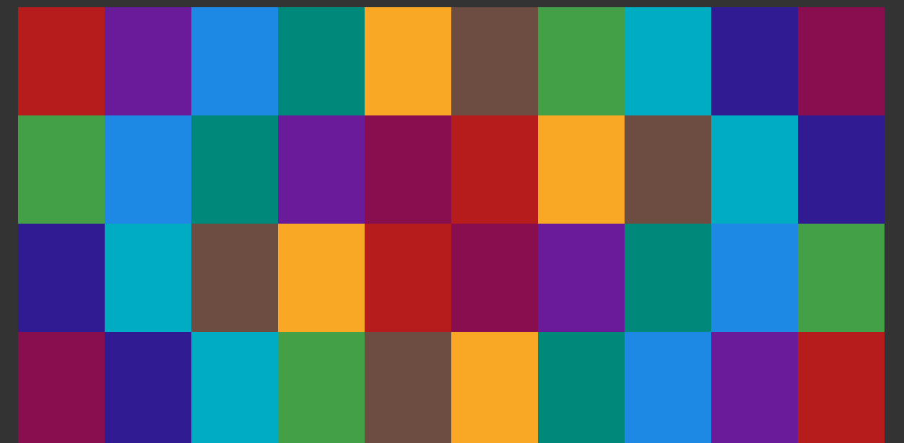
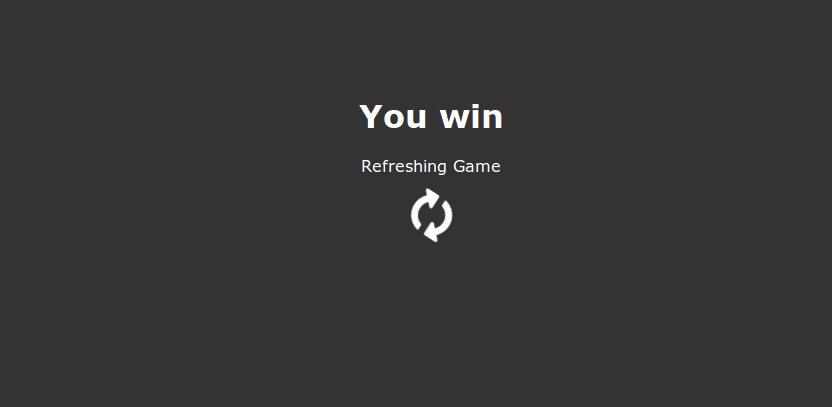

# Memory Card Game 

[Play here!](http://igameproject.com/Memory-Game/)

* __What does this project do?__

This is a clone of a classic Memory Card Game created using:
     1. HTML5
     2. Javascript
     3. DOM animation effects
     4. CSS for designing the game 

* __What is this project intended for?__

This project is intended to be a learning experience and a cool way to demonstrate the power of HTML5, Javascript and also to create awesome games to play if someone feels bored. Moreover, this project is an open source and any kind of ideas and contributions are always welcomed.

* __How can I start to contribute?__

Check out issues section and see which issue can you fix. Follow atleast Javascript ES2015 coding standards in all commits (ES6 is even better). Most importantly, please read the contribution guidelines [here](https://github.com/igameproject/Memory-Game/blob/master/contributing.md) .

If you find a way to improve the game that hasn't been mentioned in the issues, create a new issue. And most important of all discuss with your peers on what is the best way to solve a problem.

* __Whom do I contact in case of any issues?__

You can contact the owner at techie.vigneshramesh@gmail.com 

## Aim of the game

The aim of the game is to find all the matching pairs of tiles/cards in the fastest time you can.

## How to play

Just hover over a tile to reveal a symbol and try to hover over another tile in the grid which you think has the matching symbol.

If the symbol actually matches then voila, you found the correct tile and they disappear, clearing a part of the board.
Else the original tile closes and you have to try again.

You win when the entire borad is cleared after you have found all the matching pair of tiles.

Have fun!!

## License

[MIT © 2017 Indian Game Project.](../LICENSE)

