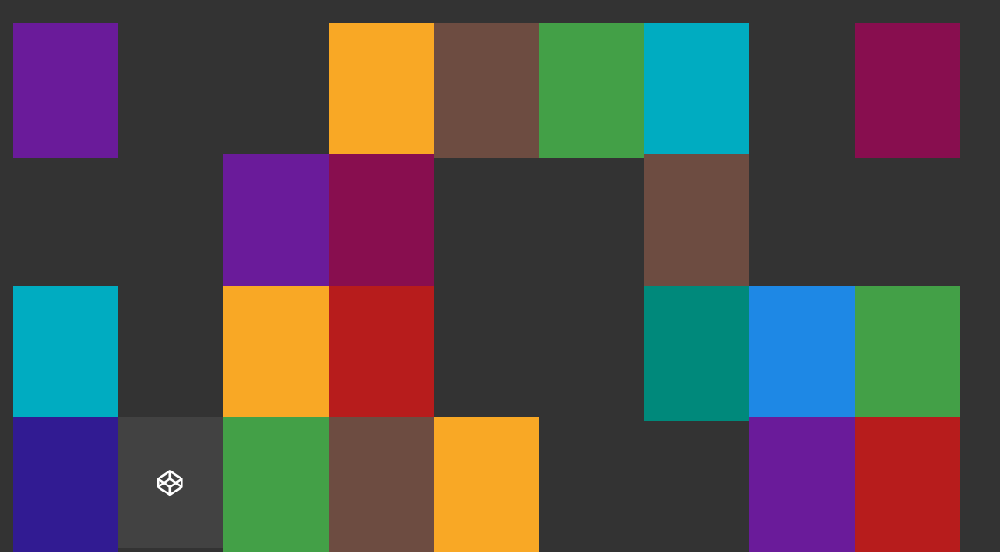

# Memory-Game

* __What does this project do ?__ 
This is a Memory Game created using HTML5, Javascript and CSS.  
[Play here!](http://igameproject.com/Memory-Game/)

* __Why is this project useful?__ 
This project is created to get user familiar with HTML5 canvas,DOM and javascript to create awesome games and have fun together as a community. This is a friendly project and any kind of ideas crazy or creative are accepted.

* __How do I get started?__ 
Check out issues section and see which issue can you fix. Follow javascript ES2015 coding standards in all commits.
If you find a way to improve the game that hasn't been mentioned in the issues. Create a new issue. And most important of all discuss with your peers on what is the best way to solve a problem

* __Where can I get more help, if I need it?__ 
You can contact the owner at techie.vigneshramesh@gmail.com

## How to play

* __Hover your mouse over the tile to flip it.__ 
* __Memorize the logo behid it.__ 
* __Match the pair of tiles with the same logo to make them disappear.__ 

* __When all tiles are matched, You win the game !!__  

