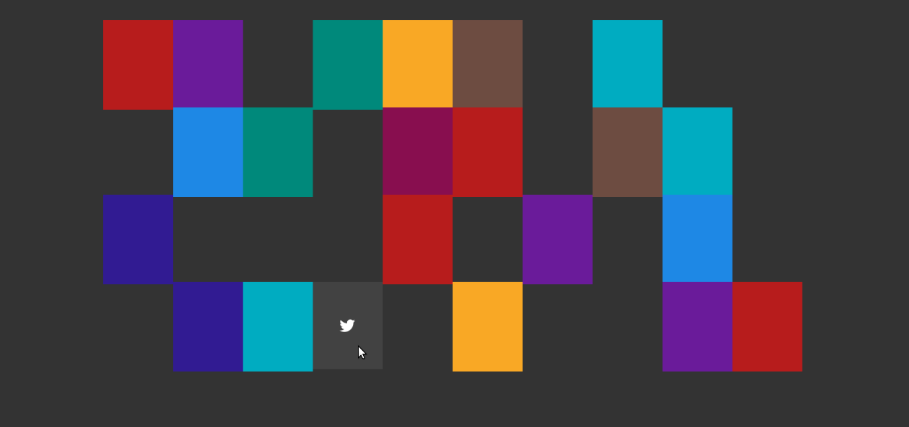
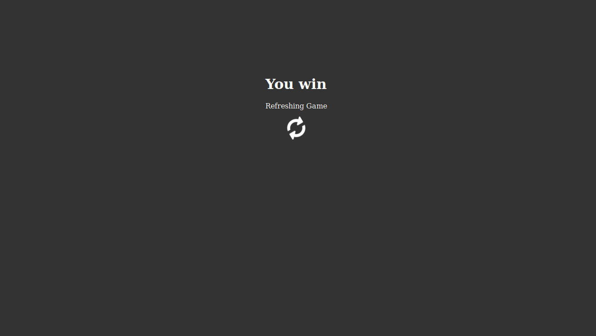

# Memory-Game
This is a memory game, a **tech companies version** of the classic **match pairs game**.
[Play here!](http://igameproject.com/Memory-Game/)

### How to play

The game is really simple, just **hover your mouse over the panels** to flip them over and show
different tech companies' logos. When you notice that two panels have the same logo, just hover
your mouse over one of the panels and flip it over, and then the other. They will both disappear.
Then keep going with the rest of the panels untill they are all gone, and **you'll have won!**.

